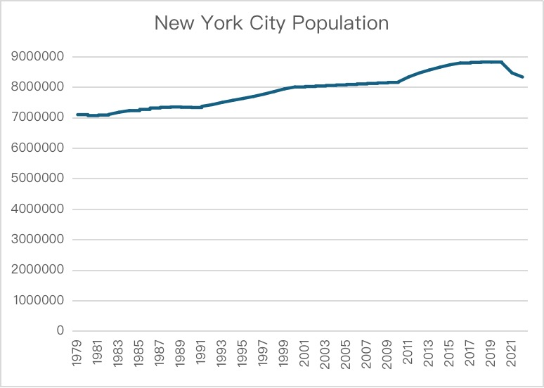

Yuhao Zhang (yz7623) and Anyu Chen (ac9250) worked as a team and collaborated on this assignment. 

# Data Set Details 
## Dataset Source
The dataset used in this analysis was obtained from the [NYC Open Data website](https://data.cityofnewyork.us/Environment/Water-Consumption-in-the-City-of-New-York/ia2d-e54m/data_preview). It provides a brief history of water consumption in the New York City Water Supply System, based on New York City Census population data, as provided by the Department of Environmental Protection (DEP). The original dataset was in CSV format and contained information on the year, New York City Population, NYC Consumption (Million gallons per day), and Per Capita (Gallons per person per day).

The visualization process involved creating various charts to gain insights into the trends and relationships present in the data. This included bar charts, line charts, scatter plots and histograms. These visualizations provided a clear understanding of how water consumption in New York City has evolved over the years, its relationship with population changes, and variations in consumption patterns.

## Raw Data From the Original Data File

Below is a sample of the raw data showing the first 20 rows of the dataset:

| Year | New York City Population | NYC Consumption (Million gallons per day) | Per Capita (Gallons per person per day) |
|------|--------------------------|-------------------------------------------|-----------------------------------------|
| 1979 | 7,102,100                | 1,512                                     | 213                                     |
| 1980 | 7,071,639                | 1,506                                     | 213                                     |
| 1981 | 7,089,241                | 1,309                                     | 185                                     |
| 1982 | 7,109,105                | 1,382                                     | 194                                     |
| 1983 | 7,181,224                | 1,424                                     | 198                                     |
| 1984 | 7,234,514                | 1,465                                     | 203                                     |
| 1985 | 7,274,054                | 1,326                                     | 182                                     |
| 1986 | 7,319,246                | 1,351                                     | 185                                     |
| 1987 | 7,342,476                | 1,447                                     | 197                                     |
| 1988 | 7,353,719                | 1,484                                     | 202                                     |
| 1989 | 7,344,175                | 1,402                                     | 191                                     |
| 1990 | 7,335,650                | 1,424                                     | 194                                     |
| 1991 | 7,374,501                | 1,469                                     | 199                                     |
| 1992 | 7,428,944                | 1,369                                     | 184                                     |
| 1993 | 7,506,166                | 1,368.5                                   | 182                                     |
| 1994 | 7,570,458                | 1,357.7                                   | 179                                     |
| 1995 | 7,633,040                | 1,325.7                                   | 174                                     |
| 1996 | 7,697,812                | 1,297.9                                   | 169                                     |
| 1997 | 7,773,443                | 1,205.5                                   | 155                                     |
| 1998 | 7,858,259                | 1,219.5                                   | 155                                     |

## Problem
Using Python, we augmented the dataset by adding another column named Percentage Change in Consumption. This column was calculated to analyze the change in water consumption over time. Following this data preprocessing step, we proceeded to visualize the dataset to draw meaningful conclusions.

## Solve
### Create a new list, adding another column
        updated_lines = []
        updated_lines.append(lines[0].strip() + ',Percentage Change in Consumption\n')

### Formatting
        for i in range(1, len(lines)):
            current_year_data = lines[i].strip().split(',')
            if i == 1:
                updated_lines.append(','.join(current_year_data) + ',\n')
            else:
                previous_year_data = lines[i-1].strip().split(',')
### Calculate Percentage Change in Consumption
        consumption_change = (float(current_year_data[2]) - float(previous_year_data[2])) / float(previous_year_data[2]) * 100
        updated_lines.append(','.join(current_year_data) + ',' + str(round(consumption_change, 2)) + '\n')

## Links of the data
[The Original Data File](/data/original_data.csv)

[The Munged Data File](/data/clean_data.csv)

[The Spreadsheet File](/data/clean_data.xlsx)

# Analysis 

## Aggregate Statistics Description

This report provides an analysis of New York City's water consumption trends based on the provided dataset. It includes calculations of aggregate statistics, a pivot table summary, and a chart visualization to offer insights into the city's water usage over the years.

The dataset revealed several key aggregate statistics:

- **Average NYC Consumption**: The average daily water consumption in New York City is approximately 1,206.558 million gallons. This large figure underscores the immense scale of water management required for the city.
- **Average Per Capita Consumption**: On average, each person in New York City uses about 154.7273 gallons of water per day. This statistic is crucial for understanding individual water usage patterns and for planning sustainable water use policies.
- **Minimum and Maximum NYC Population**: The dataset shows a minimum recorded population of 7,071,639 and a maximum of 8,826,472, indicating periods of lower and higher demand on water resources, respectively.
- **Minimum NYC Consumption**: The lowest recorded water consumption was 979 million gallons per day, possibly reflecting efficient water use or lower population levels.
- **Maximum NYC Consumption**: The highest recorded daily water consumption in New York City is 1,512 million gallons. This peak value points to periods of maximum demand on the city's water supply system, potentially driven by higher population numbers, specific events, or climatic conditions that increased water usage.
- **Sum of NYC Consumption**: The total water consumption recorded in the dataset amounts to 53,088.54 million gallons. This aggregate figure highlights the sheer volume of water managed by the city over the observed years, emphasizing the critical nature of water resource management for urban sustainability.
- **Sum of NYC Population**: The cumulative population count over the years reaches approximately 348,184,701, showcasing the massive and growing demand placed on the city's infrastructure and resources, including its water supply.
- **Total Consumption with Per Capita above 150**: A total of 30,122.4 million gallons of water were consumed in years where the per capita consumption was above 150 gallons per person per day. This statistic may reflect periods of higher water availability or less stringent conservation measures, indicating times when water use efficiency might not have been a primary concern.
- **Maximum Consumption with Negative Change**: The highest water consumption recorded in a year followed by a negative change in consumption is 1,506 million gallons. This indicates a peak in usage before measures were possibly taken to reduce consumption or in response to external factors leading to a decrease in water use.
- **Minimum Population after 1990**: The lowest population recorded after 1990 is 7,374,501, suggesting a baseline for urban planning and resource allocation in more recent years, accounting for a generally increasing trend in urban population.
- **Average Consumption on Years with Positive Change**: The average water consumption in years that saw a positive change in consumption rates is approximately 1,252.756 million gallons per day. This average suggests that in years when consumption increased, it did so to a significant extent, possibly due to population growth, economic factors, or reduced emphasis on conservation efforts.

## Chart Visualization & Description

### NYC Water Consumption (Million gallons per day) Trend Analysis

The first chart showcases the trend in New York City's daily water consumption over several decades. The line graph exhibits a clear downward trajectory from the late 1979 through 2022. Despite some minor fluctuations in the early years, the overall trend indicates a substantial reduction in water consumption. This consistent decline may reflect the success of water conservation policies, improvements in infrastructure leading to reduced wastage.

### Per Capita Water Consumption (Gallons per person per day) Trend Analysis

The second chart depicts the per capita water consumption in gallons per person per day. The data presented in the bar chart format shows a decreasing trend from the 1979 through 2022. Initially, the per capita consumption was above 200 gallons per person per day but has since dropped to around 100 gallons. This decrease might reflect a combination of factors, including increased awareness of the importance of water conservation and possibly rising water costs. 

### New York City Population Growth Trend Analysis

The third chart illustrates the population growth of New York City. Starting from 1979, there's a steady increase in population, with a plateauing trend observed in the latter years. This population growth can correlate with the increase in demand for essential services, including water supply.

### Percentage Change in Water Consumption Trend Analysis

The fourth chart presents the percentage change in water consumption year over year. The bars oscillate above and below the zero line, indicating years of increased and decreased water consumption. Notably, there are several years with significant decreases, which could be attributed to effective water conservation measures or economic events that led to a reduction in water usage. Conversely, the positive changes could be due to increased population, economic growth, or climatic conditions that need more water.